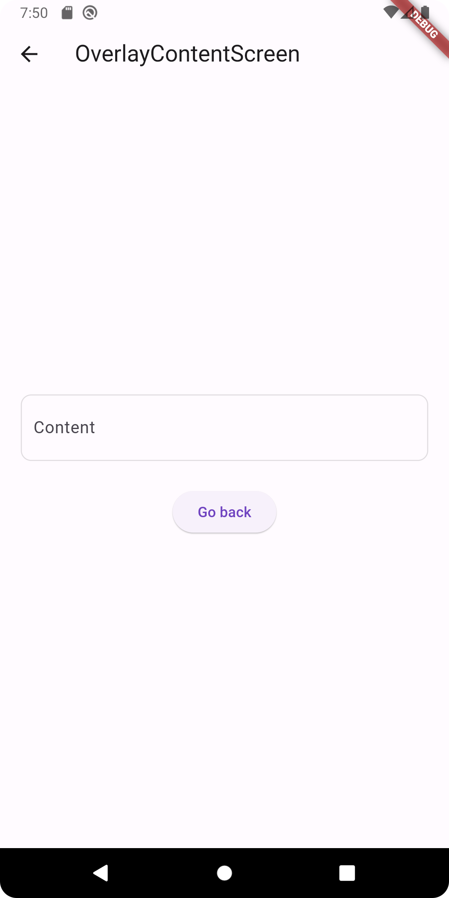
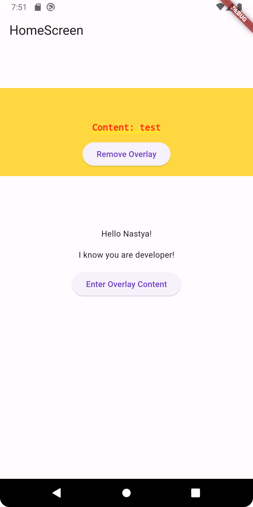

## Задание: создать несколько страниц с навигацией

#### Экран Intro

Встречаем пользователя кнопкой.
При нажатии на кнопку осуществляем переход на экран AuthenticationScreen.

#### Экран Authentication

Отображаем пользователю поле для ввода логина и dropdown для выбора профессии.

#### Экран Home

Отображаем приветствие пользователя и его роль.

#### Экран OverlayContentScreen

Отображаем поля для ввода рандомного значения.

#### Экран Home c оверлеем

Возвращаемся на экран Home. Отображаем overlay с контентом из предыдущего экрана, доваляем возможность удалить контент.

