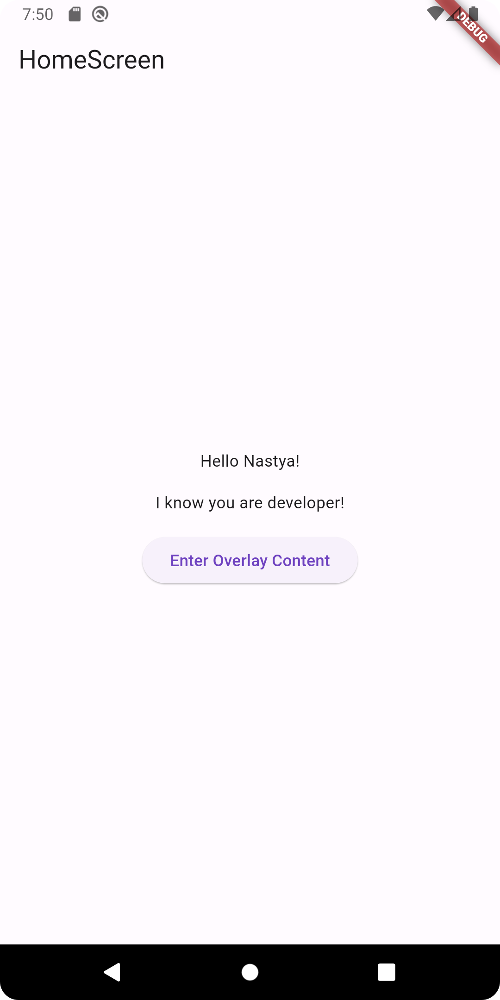

## Задание: создать несколько страниц с использованием именованной навигации

#### Экран Intro

Встречаем пользователя кнопкой.
При нажатии на кнопку осуществляем переход на экран AuthenticationScreen.

#### Экран Authentication

Отображаем пользователю поле для ввода логина и dropdown для выбора профессии.

#### Экран Home

Отображаем приветствие пользователя и его роль.

